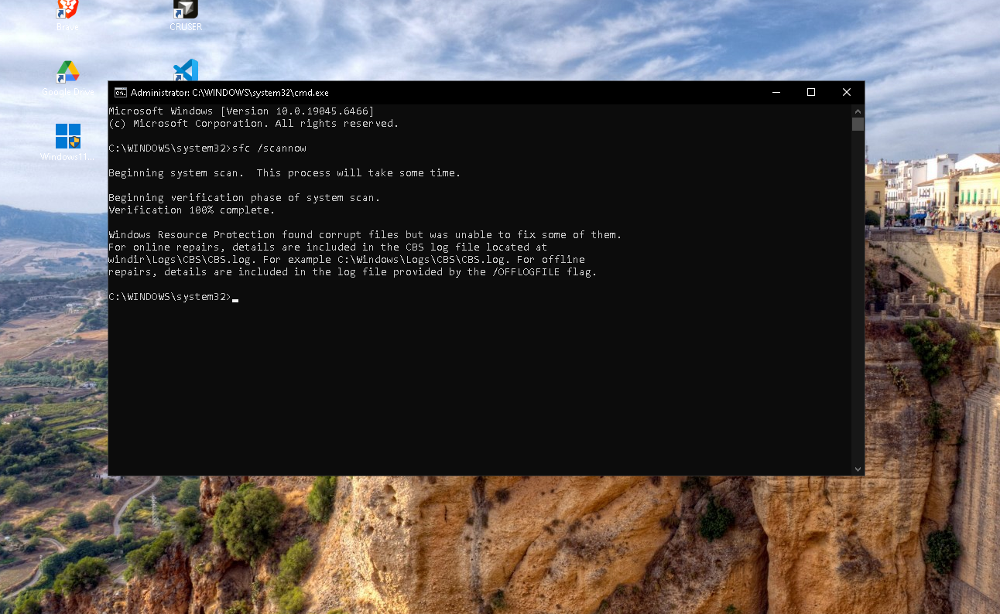
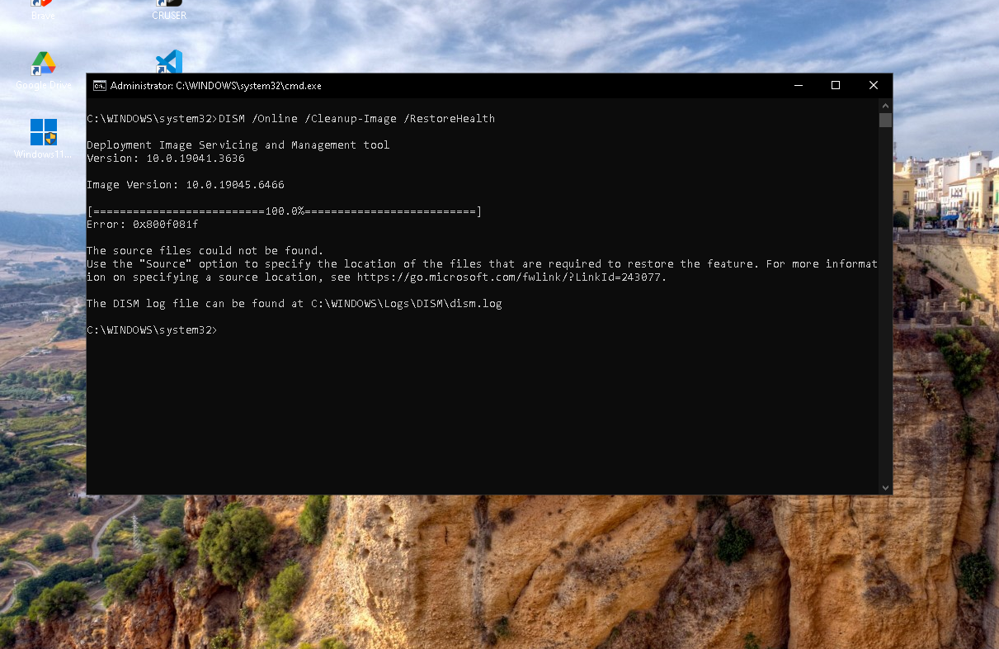
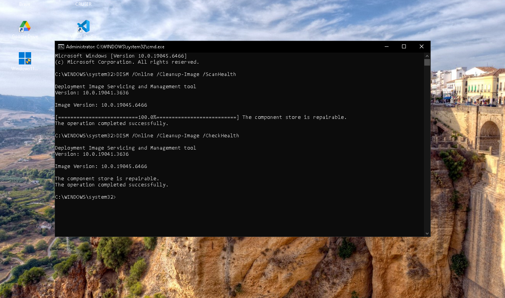
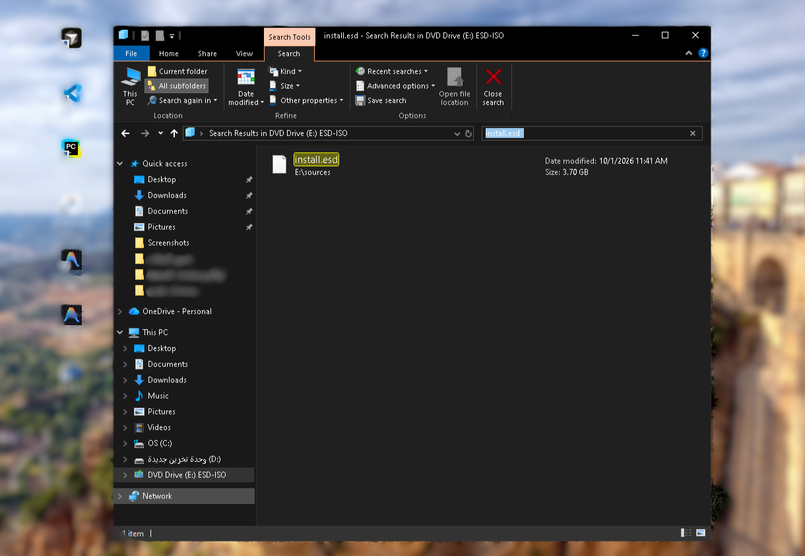
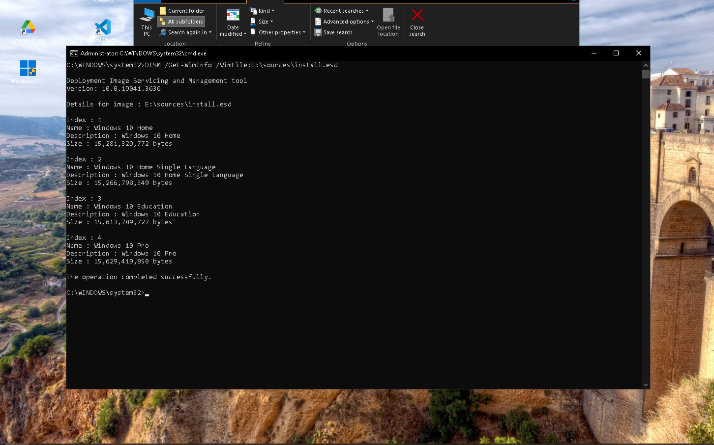
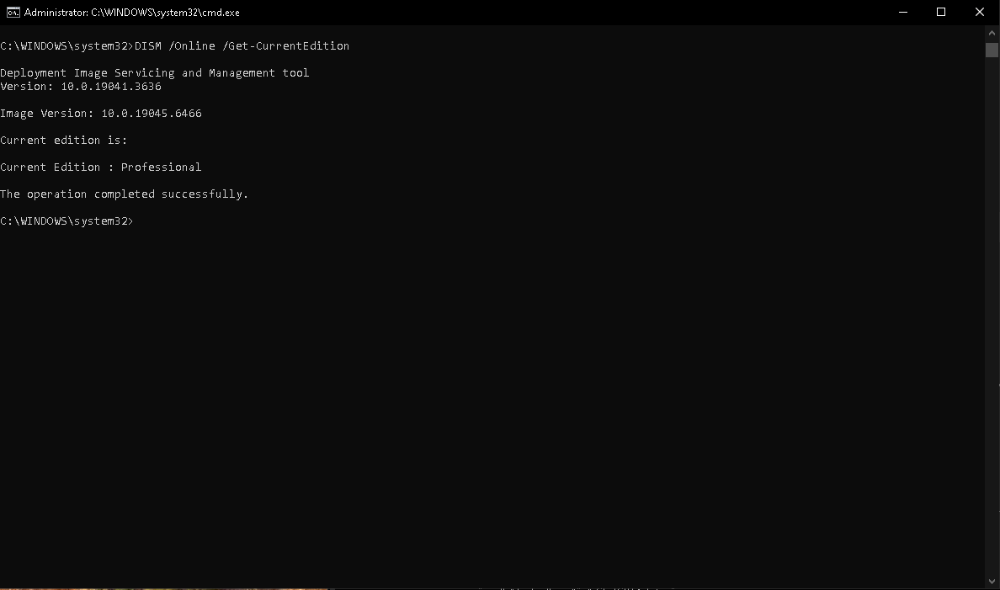
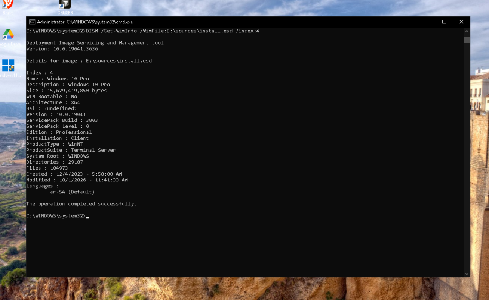

# Lab 05 - Windows Repair Diagnostics

## Overview
This lab documents a real Windows troubleshooting case involving system file corruption and DISM repair-source validation.

The goal was to determine whether Windows system files were corrupted, verify the health of the component store, investigate why DISM repair failed, and validate the compatibility of an external Windows repair source.

## Objective
Diagnose Windows system file corruption using SFC and DISM, verify repairability, and investigate the reason an external repair source could not complete the repair.

## Tools Used
- Windows Command Prompt
- System File Checker (SFC)
- Deployment Image Servicing and Management (DISM)
- Windows 10 ISO
- install.esd

## Troubleshooting Process

### 1. System File Integrity Check

The following command was used:

```cmd
sfc /scannow
```

The scan detected corrupted Windows system files and reported that some of them could not be repaired automatically.



### 2. Initial DISM Repair Attempt

The Windows image repair command was executed:

```cmd
DISM /Online /Cleanup-Image /RestoreHealth
```

The repair process failed with:

```text
Error: 0x800f081f
The source files could not be found.
```

This indicated that DISM could not locate a suitable repair source.



### 3. Component Store Health Check

The Windows component store was analyzed using:

```cmd
DISM /Online /Cleanup-Image /ScanHealth
```

and:

```cmd
DISM /Online /Cleanup-Image /CheckHealth
```

The results confirmed that the Windows component store was repairable.

```text
The component store is repairable.
```



### 4. External Repair Source Identification

A Windows 10 ISO was mounted and the installation image was located at:

```text
E:\sources\install.esd
```

This file was selected as a potential external repair source for DISM.



### 5. Windows Image Edition Inspection

The available Windows editions inside `install.esd` were inspected using:

```cmd
DISM /Get-WimInfo /WimFile:E:\sources\install.esd
```

The image contained multiple editions, including:

```text
Index 1 - Windows 10 Home
Index 2 - Windows 10 Home Single Language
Index 3 - Windows 10 Education
Index 4 - Windows 10 Pro
```

Windows 10 Pro was identified as Index 4.



### 6. Installed Windows Edition Verification

The installed Windows edition was checked using:

```cmd
DISM /Online /Get-CurrentEdition
```

The result confirmed:

```text
Current Edition: Professional
```

This matched Windows 10 Pro from Index 4 in the external repair image.



### 7. Repair Source Compatibility Analysis

The Windows 10 Pro image was inspected in more detail using:

```cmd
DISM /Get-WimInfo /WimFile:E:\sources\install.esd /index:4
```

The inspection confirmed:
- Edition: Windows 10 Pro
- Architecture: x64
- Language: ar-SA
- Repair image based on an older Windows build than the installed operating system



## Findings

- SFC detected corrupted Windows system files.
- Some corrupted files could not be repaired automatically by SFC.
- DISM confirmed that the Windows component store was repairable.
- `RestoreHealth` failed with error `0x800f081f`.
- An external Windows 10 repair source was prepared using `install.esd`.
- The installed edition matched Windows 10 Pro, Index 4.
- The repair source architecture and language were compatible.
- The repair source was based on an older Windows build than the installed operating system.
- Repair-source compatibility was identified as the most likely reason the selected source was unsuitable for completing the repair.

## Result

The troubleshooting process successfully narrowed the issue from general system file corruption to a repair-source compatibility problem.

The next appropriate action would be to obtain a matching or newer Windows repair source before attempting the repair again.

## Skills Demonstrated

- Windows system troubleshooting
- System File Checker diagnostics
- DISM diagnostics
- Windows component store analysis
- Error code investigation
- Windows image inspection
- Edition verification
- Repair source validation
- Root cause analysis
- Technical documentation
